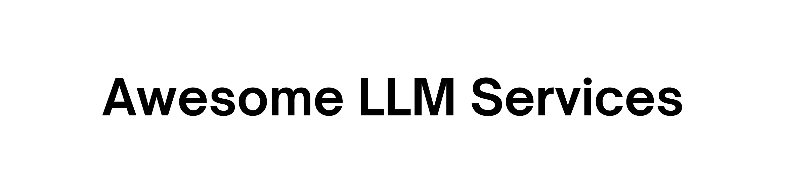

  

  
  
  
  
  

A list of **108+** LLM services, tools, and infrastructure for running AI locally. Criteria for inclusion:
- Open Source
- Self-hostable
- Friendly to containerization (Docker, Podman, etc.)
- Relates to homelab or personal AI use cases
- Well-documented with setup instructions

Relevance score ( 0–100%): a composite metric of **Popularity** (logarithm of stars) and **Recency** (exponential decay with a 90-day half-life). This highlights projects that are both widely recognized and actively maintained.

## Contents

- [ Frontends](#-frontends) - Chat interfaces and web UIs (17)
- [ Backends](#-backends) - Inference engines and model servers (17)
- [ Satellites](#-satellites) - Companion services and integrations (69)
- [ Workflow & Automation](#-workflow--automation) - Visual programming platforms (12)
- [ API & Proxies](#-api--proxies) - LLM gateways and aggregators (9)
- [ Audio & Speech](#-audio--speech) - TTS and STT services (4)
- [ CLI Tools](#-cli-tools) - Terminal-based LLM tools (15)
- [ Evaluation](#-evaluation) - Benchmarking and testing (2)
- [ MCP Tools](#-mcp-tools) - Model Context Protocol (5)

---

##  Frontends

Chat interfaces and web applications for interacting with language models.

####  **[AnythingLLM](https://github.com/Mintplex-Labs/anything-llm)** 
 89% &nbsp;  53.1k &nbsp;  issues 3.1k (254 open, 2.8k closed) &nbsp;  2026-01-09 
  &nbsp;    
The all-in-one Desktop & Docker AI application with built-in RAG, AI agents, and more.

####  **[AstrBot](https://github.com/AstrBotDevs/AstrBot)** 
 80% &nbsp;  14.9k &nbsp;  issues 3.3k (347 open, 2.9k closed) &nbsp;  2026-01-11 
  &nbsp;    
All-in-one agentic chatbot platform for multi-LLM conversations across messaging platforms with plugin system.

####  **[BionicGPT](https://github.com/bionic-gpt/bionic-gpt)** 
 50% &nbsp;  2.3k &nbsp;  issues 405 (17 open, 388 closed) &nbsp;  2025-12-09 
  &nbsp;  
on-premise LLM web UI with support for OpenAI-compatible backends

####  **[Chat Nio](https://github.com/zmh-program/chatnio)** 
 46% &nbsp;  8.9k &nbsp;  issues 309 (23 open, 286 closed) &nbsp;  2025-11-08 
  &nbsp;  
Comprehensive LLM web interface with built-in marketplace

####  **[ComfyUI](https://github.com/comfyanonymous/ComfyUI)** 
 96% &nbsp;  99.8k &nbsp;  issues 7.5k (3.2k open, 4.3k closed) &nbsp;  2026-01-11 
  &nbsp;    
The most powerful and modular diffusion model GUI, api and backend with a graph/nodes interface.

####  **[Hollama](https://github.com/fmaclen/hollama)** 
 29% &nbsp;  1.1k &nbsp;  issues 203 (65 open, 138 closed) &nbsp;  2025-10-12 
  &nbsp;  
A minimal web-UI for talking to Ollama servers.

####  **[HuggingFace ChatUI](https://github.com/huggingface/chat-ui)** 
 76% &nbsp;  10.4k &nbsp;  issues 717 (328 open, 389 closed) &nbsp;  2026-01-09 
  &nbsp;  
A chat interface using open source models, eg OpenAssistant or Llama. It is a SvelteKit app and it powers the HuggingChat app on hf.co/chat.

####  **[KoboldCpp](https://github.com/LostRuins/koboldcpp)** 
 73% &nbsp;  9.2k &nbsp;  issues 1.2k (385 open, 864 closed) &nbsp;  2026-01-05 
  &nbsp;    
KoboldCpp is an easy-to-use AI text-generation software for GGML and GGUF models.

####  **[LibreChat](https://github.com/danny-avila/LibreChat)** 
 86% &nbsp;  33.0k &nbsp;  issues 3.9k (216 open, 3.7k closed) &nbsp;  2026-01-10 
  &nbsp;  
Open-source ChatGPT UI alternative supporting multiple AI providers (Anthropic, AWS, OpenAI, Azure, Groq, Mistral, Google) with features like model switching, message search, and multi-user support. Includes integration with DALL-E-3 and various APIs.

####  **[Lobe Chat](https://github.com/lobehub/lobe-chat)** 
 93% &nbsp;  70.0k &nbsp;  issues 5.1k (1.0k open, 4.1k closed) &nbsp;  2026-01-11 
  &nbsp;   
An open-source, modern-design AI chat framework. Supports Multi AI Providers( OpenAI / Claude 3 / Gemini / Ollama / Azure / DeepSeek), Knowledge Base (file upload / knowledge management / RAG ), Multi-Modals (Vision/TTS) and plugin system.

####  **[Mikupad](https://github.com/lmg-anon/mikupad)** 
 49% &nbsp;  681 &nbsp;  issues 66 (17 open, 49 closed) &nbsp;  2025-12-27 
  &nbsp;  
LLM Frontend in a single HMTL file

####  **[ol1](https://github.com/av/harbor/tree/main/ol1)** 
 64% &nbsp;  2.2k &nbsp;  issues 161 (47 open, 114 closed) &nbsp;  2026-01-11 
  &nbsp;  
A simple Gradio app implementing an o1-like chain of reasoning with Ollama.

####  **[Omnichain](https://github.com/zenoverflow/omnichain/tree/main)** 
 8% &nbsp;  361 &nbsp;  issues 11 (1 open, 10 closed) &nbsp;  2025-05-13 
  &nbsp;  
Visual programming for AI language models

####  **[Onyx](https://github.com/onyx-dot-app/onyx)** 
 81% &nbsp;  17.0k &nbsp;  issues 987 (104 open, 883 closed) &nbsp;  2026-01-11 
  &nbsp;    
Open Source AI Platform with Chat UI, RAG, MCP support, and 40+ document connectors.

####  **[Open WebUI](https://github.com/open-webui/open-webui)** 
 97% &nbsp;  120.3k &nbsp;  issues 7.3k (144 open, 7.2k closed) &nbsp;  2026-01-10 
  &nbsp;   
widely adopted and feature rich web interface for interacting with LLMs. Supports OpenAI-compatible and Ollama backends, multi-users, multi-model chats, custom prompts, TTS, Web RAG, RAG, and much much more.

####  **[oterm](https://github.com/ggozad/oterm)** 
 54% &nbsp;  2.3k &nbsp;  issues 135 (9 open, 126 closed) &nbsp;  2025-12-19 
  &nbsp;   
The text-based terminal client for Ollama.

####  **[Parllama](https://github.com/paulrobello/parllama)** 
 37% &nbsp;  409 &nbsp;  issues 39 (8 open, 31 closed) &nbsp;  2025-12-03 
  &nbsp;  
TUI for Ollama

##  Backends

Inference engines and model serving platforms. These power the actual LLM responses.

####  **[AirLLM](https://github.com/lyogavin/airllm/tree/main)** 
 27% &nbsp;  6.9k &nbsp;  issues 195 (116 open, 79 closed) &nbsp;  2025-09-03 
  &nbsp;  
70B inference with single 4GB GPU (very slow, though)

####  **[Aphrodite](https://github.com/PygmalionAI/aphrodite-engine)** 
 60% &nbsp;  1.6k &nbsp;  issues 244 (80 open, 164 closed) &nbsp;  2026-01-07 
  &nbsp;  
Large-scale LLM inference engine

####  **[faster-whisper-server](https://github.com/fedirz/faster-whisper-server)** 
 59% &nbsp;  2.8k &nbsp;  issues 291 (79 open, 212 closed) &nbsp;  2025-12-27 
  &nbsp;    
Legacy version of Speaches, use that instead.

####  **[KoboldCpp](https://github.com/LostRuins/koboldcpp)** 
 73% &nbsp;  9.2k &nbsp;  issues 1.2k (385 open, 864 closed) &nbsp;  2026-01-05 
  &nbsp;    
KoboldCpp is an easy-to-use AI text-generation software for GGML and GGUF models.

####  **[KTransformers](https://github.com/kvcache-ai/ktransformers)** 
 77% &nbsp;  16.3k &nbsp;  issues 1.1k (392 open, 733 closed) &nbsp;  2026-01-05 
  &nbsp;  
A Flexible Framework for Experiencing Cutting-edge LLM Inference Optimizations

####  **[llama.cpp](https://github.com/ggerganov/llama.cpp)** 
 95% &nbsp;  92.8k &nbsp;  issues 6.7k (352 open, 6.3k closed) &nbsp;  2026-01-11 
  &nbsp;  
LLM inference in C/C++

####  **[mistral.rs](https://github.com/EricLBuehler/mistral.rs)** 
 72% &nbsp;  6.3k &nbsp;  issues 559 (176 open, 383 closed) &nbsp;  2026-01-09 
  &nbsp;  
Blazingly fast LLM inference.

####  **[Modular MAX](https://github.com/modular/max)** 
 85% &nbsp;  25.4k &nbsp;  issues 3.1k (692 open, 2.4k closed) &nbsp;  2026-01-11 
  &nbsp;  
MAX is a platform from Modular (creators of Mojo) for running LLMs.

####  **[Nexa SDK](https://github.com/NexaAI/nexa-sdk)** 
 73% &nbsp;  7.4k &nbsp;  issues 256 (26 open, 230 closed) &nbsp;  2026-01-09 
  &nbsp;   
Nexa SDK is a comprehensive toolkit for supporting ONNX and GGML models.

####  **[Ollama](https://github.com/ollama/ollama)** 
 100% &nbsp;  159.2k &nbsp;  issues 9.0k (1.9k open, 7.1k closed) &nbsp;  2026-01-11 
  &nbsp;  
Get up and running with Llama 3.2, Mistral, Gemma 3, and other large language models.

####  **[openedai-speech](https://github.com/matatonic/openedai-speech)** 
 4% &nbsp;  842 &nbsp;  issues 85 (7 open, 78 closed) &nbsp;  2025-02-02 
  &nbsp;   
An OpenAI API compatible text to speech server using Coqui AI's xtts_v2 and/or piper tts as the backend.

####  **[Parler](https://github.com/huggingface/parler-tts)** 
 3% &nbsp;  5.5k &nbsp;  issues 154 (115 open, 39 closed) &nbsp;  2024-12-10 
  &nbsp;   
Inference and training library for high-quality TTS models.

####  **[SGLang](https://github.com/sgl-project/sglang)** 
 84% &nbsp;  22.3k &nbsp;  issues 4.4k (660 open, 3.8k closed) &nbsp;  2026-01-11 
  &nbsp;   
SGLang is a fast serving framework for large language models and vision language models.

####  **[Speaches](https://github.com/fedirz/faster-whisper-server)** 
 59% &nbsp;  2.8k &nbsp;  issues 291 (79 open, 212 closed) &nbsp;  2025-12-27 
  &nbsp;   
an OpenAI API-compatible speech server (formerly `faster-whisper-server`), both TTS and STT

####  **[TabbyAPI](https://github.com/theroyallab/tabbyAPI)** 
 49% &nbsp;  1.1k &nbsp;  issues 228 (23 open, 205 closed) &nbsp;  2025-12-19 
  &nbsp;  
An OAI compatible exllamav2 API that's both lightweight and fast

####  **[Text Generation Inference](https://github.com/huggingface/text-generation-inference)** 
 76% &nbsp;  10.7k &nbsp;  issues 1.6k (282 open, 1.3k closed) &nbsp;  2026-01-08 
  &nbsp;  
Inference engine from HuggingFace.

####  **[vLLM](https://github.com/vllm-project/vllm)** 
 93% &nbsp;  67.3k &nbsp;  issues 12.9k (1.7k open, 11.1k closed) &nbsp;  2026-01-11 
  &nbsp;  
A high-throughput and memory-efficient inference and serving engine for LLMs

##  Satellites

Companion services, research tools, and integrations that enhance LLM workflows.

####  **[Activepieces](https://github.com/activepieces/activepieces)** 
 78% &nbsp;  20.2k &nbsp;  issues 2.6k (262 open, 2.3k closed) &nbsp;  2026-01-04 
  &nbsp;   
Open-source workflow automation platform with AI capabilities and 200+ app connectors.

####  **[Agent Zero](https://github.com/frdel/agent-zero)** 
 72% &nbsp;  13.1k &nbsp;  issues 435 (114 open, 321 closed) &nbsp;  2025-12-29 
  &nbsp;   
General-purpose personal assistant with Web RAG, persistent memory, tools, browser use and more.

####  **[aichat](https://github.com/sigoden/aichat)** 
 73% &nbsp;  9.0k &nbsp;  issues 629 (19 open, 610 closed) &nbsp;  2026-01-06 
  &nbsp;    
All-in-one LLM CLI tool featuring Shell Assistant, Chat-REPL, RAG, AI tools & agents.

####  **[Aider](https://github.com/paul-gauthier/aider)** 
 84% &nbsp;  39.7k &nbsp;  issues 3.9k (1.1k open, 2.8k closed) &nbsp;  2026-01-04 
  &nbsp;   
Aider is AI pair programming in your terminal.

####  **[Airweave](https://github.com/airweave-ai/airweave)** 
 72% &nbsp;  5.5k &nbsp;  issues 83 (31 open, 52 closed) &nbsp;  2026-01-11 
  &nbsp;   
Airweave lets agents search any app by transforming its contents into agent-ready knowledge.

####  **[AstrBot](https://github.com/AstrBotDevs/AstrBot)** 
 80% &nbsp;  14.9k &nbsp;  issues 3.3k (347 open, 2.9k closed) &nbsp;  2026-01-11 
  &nbsp;    
All-in-one agentic chatbot platform for multi-LLM conversations across messaging platforms with plugin system.

####  **[autogpt](https://github.com/Significant-Gravitas/AutoGPT)** 
 98% &nbsp;  181.0k &nbsp;  issues 3.7k (224 open, 3.4k closed) &nbsp;  2026-01-07 
  &nbsp;   
Create, deploy, and manage continuous AI agents that automate complex workflows.

####  **[Bolt.new](https://github.com/stackblitz-labs/bolt.diy)** 
 44% &nbsp;  18.8k &nbsp;  issues 939 (56 open, 883 closed) &nbsp;  2025-10-23 
  &nbsp;  
Prompt, run, edit, and deploy full-stack web applications.

####  **[Browser Use](https://github.com/browser-use/web-ui)** 
 29% &nbsp;  15.4k &nbsp;  issues 433 (259 open, 174 closed) &nbsp;  2025-08-31 
  &nbsp;   
AI-powered browser automation with web UI

####  **[cloudflared](https://github.com/cloudflare/cloudflared)** 
 53% &nbsp;  12.6k &nbsp;  issues 1.3k (452 open, 824 closed) &nbsp;  2025-11-21 
  &nbsp;     
A helper service allowing to expose Harbor services over the internet.

####  **[cmdh](https://github.com/pgibler/cmdh)** 
 14% &nbsp;  121 &nbsp;  issues 15 (8 open, 7 closed) &nbsp;  2025-08-23 
  &nbsp;   
Create Linux commands from natural language, in the shell.

####  **[DeerFlow](https://github.com/bytedance/deer-flow)** 
 76% &nbsp;  18.9k &nbsp;  issues 424 (189 open, 235 closed) &nbsp;  2026-01-01 
  &nbsp;    
Community-driven deep research framework combining LLMs with web search, crawling, and multi-agent workflows for comprehensive research reports.

####  **[Dify](https://github.com/langgenius/dify)** 
 97% &nbsp;  125.5k &nbsp;  issues 15.8k (428 open, 15.4k closed) &nbsp;  2026-01-10 
  &nbsp;   
An open-source LLM app development platform.

####  **[Docling](https://github.com/docling-project/docling)** 
 89% &nbsp;  49.7k &nbsp;  issues 1.5k (766 open, 764 closed) &nbsp;  2026-01-09 
  &nbsp;   
Transform documents into format ready for LLMs.

####  **[Drawio](https://github.com/DayuanJiang/next-ai-draw-io)** 
 82% &nbsp;  17.9k &nbsp;  issues 192 (71 open, 121 closed) &nbsp;  2026-01-11 
  &nbsp;  
AI-powered diagram creation tool - generate draw.io diagrams from natural language.

####  **[Fabric](https://github.com/danielmiessler/fabric)** 
 87% &nbsp;  38.0k &nbsp;  issues 808 (26 open, 782 closed) &nbsp;  2026-01-09 
  &nbsp;   
LLM-driven processing of the text data in the terminal.

####  **[Flowise](https://github.com/FlowiseAI/Flowise)** 
 89% &nbsp;  48.0k &nbsp;  issues 2.5k (635 open, 1.8k closed) &nbsp;  2026-01-09 
  &nbsp;   
Drag & drop UI to build your customized LLM flow.

####  **[gptme](https://github.com/ErikBjare/gptme)** 
 70% &nbsp;  4.1k &nbsp;  issues 326 (29 open, 297 closed) &nbsp;  2026-01-11 
  &nbsp;   
A simple CLI tool to interact with LLMs.

####  **[Harbor Bench](https://github.com/av/harbor/tree/main/bench)** 
 64% &nbsp;  2.2k &nbsp;  issues 161 (47 open, 114 closed) &nbsp;  2026-01-11 
  &nbsp;     
Harbor's own tool to evaluate LLMs and inference backends against custom tasks.

####  **[Harbor Boost](https://github.com/av/harbor/tree/main/boost)** 
 64% &nbsp;  2.2k &nbsp;  issues 161 (47 open, 114 closed) &nbsp;  2026-01-11 
  &nbsp;    
Connects to downstream LLM API and serves a wrapper with custom workflow. For example, it can be used to add a CoT (Chain of Thought) to an existing LLM API, and much more. Scriptable with Python.

####  **[Home Assistant](https://github.com/home-assistant/core)** 
 95% &nbsp;  84.1k &nbsp;  issues 66.7k (2.6k open, 64.1k closed) &nbsp;  2026-01-11 
  &nbsp;  
Open source home automation platform for managing and controlling smart home devices.

####  **[JupyterLab](https://github.com/jupyterlab/jupyterlab)** 
 80% &nbsp;  15.0k &nbsp;  issues 9.0k (2.4k open, 6.6k closed) &nbsp;  2026-01-10 
  &nbsp;  
Helper service to author/run Jupyter notebooks in Python with access to Harbor services.

####  **[K6](https://github.com/grafana/k6)** 
 85% &nbsp;  29.6k &nbsp;  issues 2.5k (732 open, 1.8k closed) &nbsp;  2026-01-09 
  &nbsp;   
A modern load testing tool, using Go and JavaScript - https://k6.io

####  **[Karakeep](https://github.com/karakeep-app/karakeep)** 
 84% &nbsp;  22.6k &nbsp;  issues 1.4k (481 open, 956 closed) &nbsp;  2026-01-11 
  &nbsp;  
Self-hosted bookmark manager with AI-powered automatic tagging via OpenAI or Ollama.

####  **[Khoj](https://github.com/khoj-ai/khoj)** 
 81% &nbsp;  32.1k &nbsp;  issues 557 (75 open, 482 closed) &nbsp;  2026-01-03 
  &nbsp;   
AI second brain for chat, search, and agents with your docs. Supports local and cloud LLMs.

####  **[KoboldCpp](https://github.com/LostRuins/koboldcpp)** 
 73% &nbsp;  9.2k &nbsp;  issues 1.2k (385 open, 864 closed) &nbsp;  2026-01-05 
  &nbsp;    
KoboldCpp is an easy-to-use AI text-generation software for GGML and GGUF models.

####  **[Kotaemon](https://github.com/Cinnamon/kotaemon)** 
 19% &nbsp;  24.8k &nbsp;  issues 455 (207 open, 248 closed) &nbsp;  2025-07-02 
  &nbsp;   
An open-source RAG-based tool for chatting with your documents.

####  **[LangFlow](https://github.com/langflow-ai/langflow)** 
 98% &nbsp;  143.3k &nbsp;  issues 3.1k (358 open, 2.7k closed) &nbsp;  2026-01-09 
  &nbsp;    
A low-code app builder for RAG and multi-agent AI applications.

####  **[LangFuse](https://github.com/langfuse/langfuse)** 
 82% &nbsp;  20.4k &nbsp;  issues 2.2k (298 open, 1.9k closed) &nbsp;  2026-01-09 
  &nbsp;    
Open source LLM engineering platform: LLM Observability, metrics, evals, prompt management, playground, datasets.

####  **[Latent Scope](https://github.com/enjalot/latent-scope)** 
 36% &nbsp;  747 &nbsp;  issues 74 (34 open, 40 closed) &nbsp;  2025-11-17 
  &nbsp;  
A new kind of workflow + tool for visualizing and exploring datasets through the lens of latent spaces.

####  **[LibreTranslate](https://github.com/LibreTranslate/LibreTranslate)** 
 69% &nbsp;  13.5k &nbsp;  issues 545 (124 open, 421 closed) &nbsp;  2025-12-23 
  &nbsp;  
A free and open-source machine translation.

####  **[LiteLLM](https://github.com/BerriAI/litellm)** 
 87% &nbsp;  33.6k &nbsp;  issues 8.4k (874 open, 7.5k closed) &nbsp;  2026-01-11 
  &nbsp;    
LLM proxy that can aggregate multiple inference APIs together into a single endpoint.

####  **[LitLytics](https://github.com/yamalight/litlytics)** 
 2% &nbsp;  103 &nbsp;  issues 16 (3 open, 13 closed) &nbsp;  2024-11-25 
  &nbsp;    
Simple analytics platform that leverages LLMs to automate data analysis.

####  **[llama-swap](https://github.com/mostlygeek/llama-swap)** 
 64% &nbsp;  2.2k &nbsp;  issues 234 (4 open, 230 closed) &nbsp;  2026-01-11 
  &nbsp;   
Runs multiple llama.cpp servers on demand for seamless switching between them.

####  **[lm-evaluation-harness](https://github.com/EleutherAI/lm-evaluation-harness)** 
 75% &nbsp;  11.1k &nbsp;  issues 1.6k (533 open, 1.0k closed) &nbsp;  2026-01-07 
  &nbsp;    
A de-facto standard framework for the few-shot evaluation of language models.

####  **[Local Deep Research](https://github.com/LearningCircuit/local-deep-research)** 
 69% &nbsp;  3.8k &nbsp;  issues 242 (40 open, 202 closed) &nbsp;  2026-01-11 
  &nbsp;  
Transforms complex questions into comprehensive, cited reports.

####  **[LocalAI](https://github.com/go-skynet/LocalAI)** 
 88% &nbsp;  41.3k &nbsp;  issues 1.2k (147 open, 1.1k closed) &nbsp;  2026-01-10 
  &nbsp;   
Complete AI stack for running AI models locally. Allows downloading variety of LLMs, TTS/STT/Image models and running thme locally via Web UI.

####  **[MCP Forge](https://github.com/IBM/mcp-context-forge)** 
 67% &nbsp;  3.1k &nbsp;  issues 937 (354 open, 583 closed) &nbsp;  2026-01-11 
  &nbsp;   
Gateway and admin UI for managing Model Context Protocol (MCP) servers, tools, and resources.

####  **[mcpo](https://github.com/open-webui/mcpo)** 
 35% &nbsp;  3.9k &nbsp;  issues 125 (37 open, 88 closed) &nbsp;  2025-10-14 
  &nbsp;   
Turn MCP servers into OpenAPI REST APIs - use them anywhere.

####  **[MetaMCP](https://github.com/metatool-ai/metatool-app)** 
 54% &nbsp;  1.9k &nbsp;  issues 152 (57 open, 95 closed) &nbsp;  2025-12-23 
  &nbsp;   
Allows to manage MCPs via a WebUI, exposes multiple MCPs as a single server.

####  **[MindsDB](https://github.com/mindsdb/mindsdb)** 
 87% &nbsp;  38.2k &nbsp;  issues 4.4k (67 open, 4.3k closed) &nbsp;  2026-01-09 
  &nbsp;   
AI platform for integrating ML models with data sources via HTTP and MySQL APIs.

####  **[Morphic](https://github.com/miurla/morphic)** 
 61% &nbsp;  8.5k &nbsp;  issues 253 (55 open, 198 closed) &nbsp;  2025-12-15 
  &nbsp;   
An AI-powered search engine with a generative UI, similar to Perplexity and Perplexica.

####  **[n8n](https://github.com/n8n-io/n8n)** 
 100% &nbsp;  168.1k &nbsp;  issues 7.4k (474 open, 7.0k closed) &nbsp;  2026-01-10 
  &nbsp;   
Fair-code workflow automation platform with native AI capabilities.

####  **[Netdata](https://github.com/netdata/netdata)** 
 94% &nbsp;  77.3k &nbsp;  issues 8.2k (169 open, 8.0k closed) &nbsp;  2026-01-11 
  &nbsp;   
Real-time infrastructure monitoring with per-second metrics for systems, containers, and applications.

####  **[OmniParser](https://github.com/microsoft/OmniParser)** 
 32% &nbsp;  24.2k &nbsp;  issues 241 (172 open, 69 closed) &nbsp;  2025-09-09 
  &nbsp;   
A simple screen parsing tool towards pure vision based GUI agent.

####  **[Open Interpreter](https://github.com/OpenInterpreter/open-interpreter)** 
 69% &nbsp;  61.6k &nbsp;  issues 1.0k (239 open, 804 closed) &nbsp;  2025-12-05 
  &nbsp;   
A natural language interface for computers.

####  **[Open Notebook](https://github.com/lfnovo/open-notebook)** 
 80% &nbsp;  17.7k &nbsp;  issues 225 (75 open, 150 closed) &nbsp;  2026-01-09 
  &nbsp;  
AI-powered research and note-taking platform with multi-provider LLM support, podcast generation, and content analysis.

####  **[Open WebUI Pipelines](https://github.com/open-webui/pipelines)** 
 21% &nbsp;  2.2k &nbsp;  issues 272 (147 open, 125 closed) &nbsp;  2025-08-18 
  &nbsp;    
UI-Agnostic OpenAI API Plugin Framework.

####  **[OpenHands](https://github.com/All-Hands-AI/OpenHands)** 
 92% &nbsp;  66.5k &nbsp;  issues 3.7k (132 open, 3.5k closed) &nbsp;  2026-01-10 
  &nbsp;   
A platform for software development agents powered by AI.

####  **[OptiLLM](https://github.com/codelion/optillm)** 
 59% &nbsp;  3.3k &nbsp;  issues 88 (12 open, 76 closed) &nbsp;  2025-12-25 
  &nbsp;    
Optimising LLM proxy that implements many advanced workflows to boost the performance of the LLMs.

####  **[Perplexica](https://github.com/ItzCrazyKns/Perplexica)** 
 85% &nbsp;  28.1k &nbsp;  issues 598 (169 open, 429 closed) &nbsp;  2026-01-10 
  &nbsp;   
An AI-powered search engine. It is an Open source alternative to Perplexity AI.

####  **[PhotoPrism](https://github.com/photoprism/photoprism)** 
 85% &nbsp;  39.1k &nbsp;  issues 2.5k (415 open, 2.0k closed) &nbsp;  2026-01-06 
  &nbsp;   
AI-powered photo management app with face recognition, image classification, and automatic organization.

####  **[Plandex](https://github.com/plandex-ai/plandex)** 
 37% &nbsp;  14.9k &nbsp;  issues 195 (29 open, 166 closed) &nbsp;  2025-10-03 
  &nbsp;   
AI driven development in your terminal.

####  **[Presenton](https://github.com/presenton/presenton)** 
 65% &nbsp;  3.6k &nbsp;  issues 160 (43 open, 117 closed) &nbsp;  2026-01-04 
  &nbsp;  
Open-source AI presentation generator with custom layouts, multi-model support, and PDF/PPTX export.

####  **[Promptfoo](https://github.com/promptfoo/promptfoo)** 
 77% &nbsp;  9.8k &nbsp;  issues 1.1k (80 open, 985 closed) &nbsp;  2026-01-11 
  &nbsp;   
Test your prompts, agents, and RAGs. A developer-friendly local tool for testing LLM applications.

####  **[Qdrant](https://github.com/qdrant/qdrant)** 
 74% &nbsp;  28.1k &nbsp;  issues 1.7k (374 open, 1.3k closed) &nbsp;  2025-12-24 
  &nbsp;    
Qdrant - High-performance, massive-scale Vector Database and Vector Search Engine.

####  **[RAGLite](https://github.com/superlinear-ai/raglite)** 
 48% &nbsp;  1.1k &nbsp;  issues 40 (13 open, 27 closed) &nbsp;  2025-12-15 
  &nbsp;   
Python toolkit for Retrieval-Augmented Generation (RAG)

####  **[Repopack](https://github.com/yamadashy/repopack)** 
 83% &nbsp;  21.1k &nbsp;  issues 226 (120 open, 106 closed) &nbsp;  2026-01-11 
  &nbsp;   
A powerful tool that packs your entire repository into a single, AI-friendly file.

#### **[Resume Matcher](https://github.com/srbhr/Resume-Matcher)** 
 82% &nbsp;  25.6k &nbsp;  issues 182 (8 open, 174 closed) &nbsp;  2026-01-07 
  &nbsp;  
AI-powered tool for comparing resumes against job descriptions using local LLMs via Ollama.

####  **[SearXNG](https://github.com/searxng/searxng)** 
 84% &nbsp;  24.0k &nbsp;  issues 1.7k (182 open, 1.5k closed) &nbsp;  2026-01-11 
  &nbsp;  
A privacy-respecting, hackable metasearch engine. Highly configurable and can be used for Web RAG use-cases.

####  **[Sim Studio](https://github.com/simstudioai/sim)** 
 84% &nbsp;  25.3k &nbsp;  issues 376 (97 open, 279 closed) &nbsp;  2026-01-10 
  &nbsp;   
Open-source platform to build and deploy AI agent workflows with visual canvas editor.

####  **[SQL Chat](https://github.com/sqlchat/sqlchat)** 
 18% &nbsp;  5.7k &nbsp;  issues 80 (20 open, 60 closed) &nbsp;  2025-07-12 
  &nbsp;  
Chat-based SQL client, which uses natural language to communicate with the database.

####  **[SuperGateway](https://github.com/supercorp-ai/supergateway)** 
 31% &nbsp;  2.4k &nbsp;  issues 69 (27 open, 42 closed) &nbsp;  2025-10-09 
  &nbsp;     
A simple and powerful API gateway for LLMs.

####  **[TextGrad](https://github.com/zou-group/textgrad)** 
 18% &nbsp;  3.3k &nbsp;  issues 120 (42 open, 78 closed) &nbsp;  2025-07-25 
  &nbsp;  
Automatic "Differentiation" via Text - using large language models to backpropagate textual gradients.

####  **[Traefik](https://github.com/traefik/traefik)** 
 90% &nbsp;  61.0k &nbsp;  issues 6.5k (667 open, 5.9k closed) &nbsp;  2026-01-08 
  &nbsp;    
A modern HTTP reverse proxy and load balancer that makes deploying microservices easy.

####  **[txtai RAG](https://github.com/neuml/rag)** 
 37% &nbsp;  434 &nbsp;  issues 31 (2 open, 29 closed) &nbsp;  2025-12-01 
  &nbsp;   
RAG WebUI built with txtai.

####  **[Unsloth](https://github.com/unslothai/unsloth)** 
 90% &nbsp;  50.6k &nbsp;  issues 2.9k (824 open, 2.0k closed) &nbsp;  2026-01-10 
  &nbsp;  
Jupyter Lab environment with Unsloth for fast LLM fine-tuning - 2x faster training with 70% less memory.

####  **[Webtop](https://github.com/linuxserver/docker-webtop)** 
 66% &nbsp;  3.8k &nbsp;  issues 140 (8 open, 132 closed) &nbsp;  2026-01-06 
  &nbsp;  
Linux in a web browser supporting popular desktop environments.

####  **[Windmill](https://github.com/windmill-labs/windmill)** 
 81% &nbsp;  15.5k &nbsp;  issues 1.4k (502 open, 855 closed) &nbsp;  2026-01-11 
  &nbsp;   
Open-source developer platform for internal tools, workflows, and UIs with multi-language script support.

##  Workflow & Automation

Visual programming, workflow automation, and orchestration platforms for building LLM applications.

####  **[Activepieces](https://github.com/activepieces/activepieces)** 
 78% &nbsp;  20.2k &nbsp;  issues 2.6k (262 open, 2.3k closed) &nbsp;  2026-01-04 
  &nbsp;   
Open-source workflow automation platform with AI capabilities and 200+ app connectors.

####  **[ComfyUI](https://github.com/comfyanonymous/ComfyUI)** 
 96% &nbsp;  99.8k &nbsp;  issues 7.5k (3.2k open, 4.3k closed) &nbsp;  2026-01-11 
  &nbsp;    
The most powerful and modular diffusion model GUI, api and backend with a graph/nodes interface.

####  **[DeerFlow](https://github.com/bytedance/deer-flow)** 
 76% &nbsp;  18.9k &nbsp;  issues 424 (189 open, 235 closed) &nbsp;  2026-01-01 
  &nbsp;    
Community-driven deep research framework combining LLMs with web search, crawling, and multi-agent workflows for comprehensive research reports.

####  **[Dify](https://github.com/langgenius/dify)** 
 97% &nbsp;  125.5k &nbsp;  issues 15.8k (428 open, 15.4k closed) &nbsp;  2026-01-10 
  &nbsp;   
An open-source LLM app development platform.

####  **[Flowise](https://github.com/FlowiseAI/Flowise)** 
 89% &nbsp;  48.0k &nbsp;  issues 2.5k (635 open, 1.8k closed) &nbsp;  2026-01-09 
  &nbsp;   
Drag & drop UI to build your customized LLM flow.

####  **[LangFlow](https://github.com/langflow-ai/langflow)** 
 98% &nbsp;  143.3k &nbsp;  issues 3.1k (358 open, 2.7k closed) &nbsp;  2026-01-09 
  &nbsp;    
A low-code app builder for RAG and multi-agent AI applications.

####  **[LitLytics](https://github.com/yamalight/litlytics)** 
 2% &nbsp;  103 &nbsp;  issues 16 (3 open, 13 closed) &nbsp;  2024-11-25 
  &nbsp;    
Simple analytics platform that leverages LLMs to automate data analysis.

####  **[n8n](https://github.com/n8n-io/n8n)** 
 100% &nbsp;  168.1k &nbsp;  issues 7.4k (474 open, 7.0k closed) &nbsp;  2026-01-10 
  &nbsp;   
Fair-code workflow automation platform with native AI capabilities.

####  **[Onyx](https://github.com/onyx-dot-app/onyx)** 
 81% &nbsp;  17.0k &nbsp;  issues 987 (104 open, 883 closed) &nbsp;  2026-01-11 
  &nbsp;    
Open Source AI Platform with Chat UI, RAG, MCP support, and 40+ document connectors.

####  **[Open WebUI Pipelines](https://github.com/open-webui/pipelines)** 
 21% &nbsp;  2.2k &nbsp;  issues 272 (147 open, 125 closed) &nbsp;  2025-08-18 
  &nbsp;    
UI-Agnostic OpenAI API Plugin Framework.

####  **[Sim Studio](https://github.com/simstudioai/sim)** 
 84% &nbsp;  25.3k &nbsp;  issues 376 (97 open, 279 closed) &nbsp;  2026-01-10 
  &nbsp;   
Open-source platform to build and deploy AI agent workflows with visual canvas editor.

####  **[Windmill](https://github.com/windmill-labs/windmill)** 
 81% &nbsp;  15.5k &nbsp;  issues 1.4k (502 open, 855 closed) &nbsp;  2026-01-11 
  &nbsp;   
Open-source developer platform for internal tools, workflows, and UIs with multi-language script support.

##  API & Proxies

API gateways, proxies, and aggregation services for managing multiple LLM endpoints.

####  **[cloudflared](https://github.com/cloudflare/cloudflared)** 
 53% &nbsp;  12.6k &nbsp;  issues 1.3k (452 open, 824 closed) &nbsp;  2025-11-21 
  &nbsp;     
A helper service allowing to expose Harbor services over the internet.

####  **[Harbor Boost](https://github.com/av/harbor/tree/main/boost)** 
 64% &nbsp;  2.2k &nbsp;  issues 161 (47 open, 114 closed) &nbsp;  2026-01-11 
  &nbsp;    
Connects to downstream LLM API and serves a wrapper with custom workflow. For example, it can be used to add a CoT (Chain of Thought) to an existing LLM API, and much more. Scriptable with Python.

####  **[LangFuse](https://github.com/langfuse/langfuse)** 
 82% &nbsp;  20.4k &nbsp;  issues 2.2k (298 open, 1.9k closed) &nbsp;  2026-01-09 
  &nbsp;    
Open source LLM engineering platform: LLM Observability, metrics, evals, prompt management, playground, datasets.

####  **[LiteLLM](https://github.com/BerriAI/litellm)** 
 87% &nbsp;  33.6k &nbsp;  issues 8.4k (874 open, 7.5k closed) &nbsp;  2026-01-11 
  &nbsp;    
LLM proxy that can aggregate multiple inference APIs together into a single endpoint.

####  **[llama-swap](https://github.com/mostlygeek/llama-swap)** 
 64% &nbsp;  2.2k &nbsp;  issues 234 (4 open, 230 closed) &nbsp;  2026-01-11 
  &nbsp;   
Runs multiple llama.cpp servers on demand for seamless switching between them.

####  **[MindsDB](https://github.com/mindsdb/mindsdb)** 
 87% &nbsp;  38.2k &nbsp;  issues 4.4k (67 open, 4.3k closed) &nbsp;  2026-01-09 
  &nbsp;   
AI platform for integrating ML models with data sources via HTTP and MySQL APIs.

####  **[Open WebUI Pipelines](https://github.com/open-webui/pipelines)** 
 21% &nbsp;  2.2k &nbsp;  issues 272 (147 open, 125 closed) &nbsp;  2025-08-18 
  &nbsp;    
UI-Agnostic OpenAI API Plugin Framework.

####  **[OptiLLM](https://github.com/codelion/optillm)** 
 59% &nbsp;  3.3k &nbsp;  issues 88 (12 open, 76 closed) &nbsp;  2025-12-25 
  &nbsp;    
Optimising LLM proxy that implements many advanced workflows to boost the performance of the LLMs.

####  **[Traefik](https://github.com/traefik/traefik)** 
 90% &nbsp;  61.0k &nbsp;  issues 6.5k (667 open, 5.9k closed) &nbsp;  2026-01-08 
  &nbsp;    
A modern HTTP reverse proxy and load balancer that makes deploying microservices easy.

##  Audio & Speech

Text-to-speech (TTS), speech-to-text (STT), and audio processing services.

####  **[faster-whisper-server](https://github.com/fedirz/faster-whisper-server)** 
 59% &nbsp;  2.8k &nbsp;  issues 291 (79 open, 212 closed) &nbsp;  2025-12-27 
  &nbsp;    
Legacy version of Speaches, use that instead.

####  **[openedai-speech](https://github.com/matatonic/openedai-speech)** 
 4% &nbsp;  842 &nbsp;  issues 85 (7 open, 78 closed) &nbsp;  2025-02-02 
  &nbsp;   
An OpenAI API compatible text to speech server using Coqui AI's xtts_v2 and/or piper tts as the backend.

####  **[Parler](https://github.com/huggingface/parler-tts)** 
 3% &nbsp;  5.5k &nbsp;  issues 154 (115 open, 39 closed) &nbsp;  2024-12-10 
  &nbsp;   
Inference and training library for high-quality TTS models.

####  **[Speaches](https://github.com/fedirz/faster-whisper-server)** 
 59% &nbsp;  2.8k &nbsp;  issues 291 (79 open, 212 closed) &nbsp;  2025-12-27 
  &nbsp;   
an OpenAI API-compatible speech server (formerly `faster-whisper-server`), both TTS and STT

##  CLI Tools

Command-line interfaces and terminal-based tools for LLM interaction.

####  **[aichat](https://github.com/sigoden/aichat)** 
 73% &nbsp;  9.0k &nbsp;  issues 629 (19 open, 610 closed) &nbsp;  2026-01-06 
  &nbsp;    
All-in-one LLM CLI tool featuring Shell Assistant, Chat-REPL, RAG, AI tools & agents.

####  **[Aider](https://github.com/paul-gauthier/aider)** 
 84% &nbsp;  39.7k &nbsp;  issues 3.9k (1.1k open, 2.8k closed) &nbsp;  2026-01-04 
  &nbsp;   
Aider is AI pair programming in your terminal.

####  **[cloudflared](https://github.com/cloudflare/cloudflared)** 
 53% &nbsp;  12.6k &nbsp;  issues 1.3k (452 open, 824 closed) &nbsp;  2025-11-21 
  &nbsp;     
A helper service allowing to expose Harbor services over the internet.

####  **[cmdh](https://github.com/pgibler/cmdh)** 
 14% &nbsp;  121 &nbsp;  issues 15 (8 open, 7 closed) &nbsp;  2025-08-23 
  &nbsp;   
Create Linux commands from natural language, in the shell.

####  **[Fabric](https://github.com/danielmiessler/fabric)** 
 87% &nbsp;  38.0k &nbsp;  issues 808 (26 open, 782 closed) &nbsp;  2026-01-09 
  &nbsp;   
LLM-driven processing of the text data in the terminal.

####  **[gptme](https://github.com/ErikBjare/gptme)** 
 70% &nbsp;  4.1k &nbsp;  issues 326 (29 open, 297 closed) &nbsp;  2026-01-11 
  &nbsp;   
A simple CLI tool to interact with LLMs.

####  **[Harbor Bench](https://github.com/av/harbor/tree/main/bench)** 
 64% &nbsp;  2.2k &nbsp;  issues 161 (47 open, 114 closed) &nbsp;  2026-01-11 
  &nbsp;     
Harbor's own tool to evaluate LLMs and inference backends against custom tasks.

####  **[K6](https://github.com/grafana/k6)** 
 85% &nbsp;  29.6k &nbsp;  issues 2.5k (732 open, 1.8k closed) &nbsp;  2026-01-09 
  &nbsp;   
A modern load testing tool, using Go and JavaScript - https://k6.io

####  **[lm-evaluation-harness](https://github.com/EleutherAI/lm-evaluation-harness)** 
 75% &nbsp;  11.1k &nbsp;  issues 1.6k (533 open, 1.0k closed) &nbsp;  2026-01-07 
  &nbsp;    
A de-facto standard framework for the few-shot evaluation of language models.

####  **[Open Interpreter](https://github.com/OpenInterpreter/open-interpreter)** 
 69% &nbsp;  61.6k &nbsp;  issues 1.0k (239 open, 804 closed) &nbsp;  2025-12-05 
  &nbsp;   
A natural language interface for computers.

####  **[oterm](https://github.com/ggozad/oterm)** 
 54% &nbsp;  2.3k &nbsp;  issues 135 (9 open, 126 closed) &nbsp;  2025-12-19 
  &nbsp;   
The text-based terminal client for Ollama.

####  **[Plandex](https://github.com/plandex-ai/plandex)** 
 37% &nbsp;  14.9k &nbsp;  issues 195 (29 open, 166 closed) &nbsp;  2025-10-03 
  &nbsp;   
AI driven development in your terminal.

####  **[Promptfoo](https://github.com/promptfoo/promptfoo)** 
 77% &nbsp;  9.8k &nbsp;  issues 1.1k (80 open, 985 closed) &nbsp;  2026-01-11 
  &nbsp;   
Test your prompts, agents, and RAGs. A developer-friendly local tool for testing LLM applications.

####  **[Repopack](https://github.com/yamadashy/repopack)** 
 83% &nbsp;  21.1k &nbsp;  issues 226 (120 open, 106 closed) &nbsp;  2026-01-11 
  &nbsp;   
A powerful tool that packs your entire repository into a single, AI-friendly file.

####  **[SuperGateway](https://github.com/supercorp-ai/supergateway)** 
 31% &nbsp;  2.4k &nbsp;  issues 69 (27 open, 42 closed) &nbsp;  2025-10-09 
  &nbsp;     
A simple and powerful API gateway for LLMs.

##  Evaluation

Benchmarking, evaluation, and testing tools for measuring LLM performance.

####  **[Harbor Bench](https://github.com/av/harbor/tree/main/bench)** 
 64% &nbsp;  2.2k &nbsp;  issues 161 (47 open, 114 closed) &nbsp;  2026-01-11 
  &nbsp;     
Harbor's own tool to evaluate LLMs and inference backends against custom tasks.

####  **[lm-evaluation-harness](https://github.com/EleutherAI/lm-evaluation-harness)** 
 75% &nbsp;  11.1k &nbsp;  issues 1.6k (533 open, 1.0k closed) &nbsp;  2026-01-07 
  &nbsp;    
A de-facto standard framework for the few-shot evaluation of language models.

##  MCP Tools

Model Context Protocol servers and tool integration services.

####  **[AstrBot](https://github.com/AstrBotDevs/AstrBot)** 
 80% &nbsp;  14.9k &nbsp;  issues 3.3k (347 open, 2.9k closed) &nbsp;  2026-01-11 
  &nbsp;    
All-in-one agentic chatbot platform for multi-LLM conversations across messaging platforms with plugin system.

####  **[MCP Forge](https://github.com/IBM/mcp-context-forge)** 
 67% &nbsp;  3.1k &nbsp;  issues 937 (354 open, 583 closed) &nbsp;  2026-01-11 
  &nbsp;   
Gateway and admin UI for managing Model Context Protocol (MCP) servers, tools, and resources.

####  **[mcpo](https://github.com/open-webui/mcpo)** 
 35% &nbsp;  3.9k &nbsp;  issues 125 (37 open, 88 closed) &nbsp;  2025-10-14 
  &nbsp;   
Turn MCP servers into OpenAPI REST APIs - use them anywhere.

####  **[MetaMCP](https://github.com/metatool-ai/metatool-app)** 
 54% &nbsp;  1.9k &nbsp;  issues 152 (57 open, 95 closed) &nbsp;  2025-12-23 
  &nbsp;   
Allows to manage MCPs via a WebUI, exposes multiple MCPs as a single server.

####  **[SuperGateway](https://github.com/supercorp-ai/supergateway)** 
 31% &nbsp;  2.4k &nbsp;  issues 69 (27 open, 42 closed) &nbsp;  2025-10-09 
  &nbsp;     
A simple and powerful API gateway for LLMs.

## Contributing

This list is auto-generated from [Harbor's service metadata](https://github.com/av/harbor).

  Made with  by the <a href="https://github.com/av/harbor">Harbor</a> community

